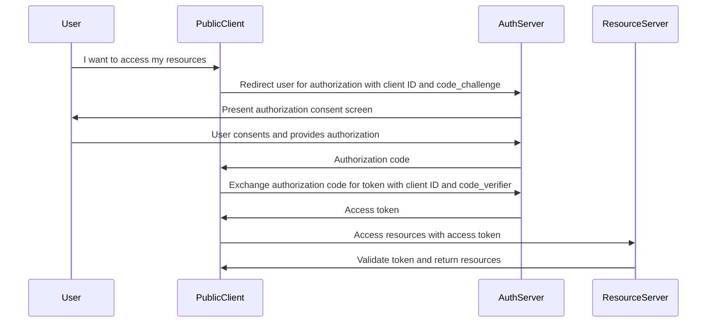

## 목차

<TOCInline toc={props.toc} exclude="목차" toHeading={(2, 3)} />

## 개요

MSA는 여러 **독립적인** 서비스가 한 시스템을 구성합니다. 시스템 속 정보와 서버 자원을 보호하기 위해선 **인증**되고, **인가**된 유저만 서버에 요청할 수 있어야합니다.
여러 독립적인 서비스 각각이 인증과 인가를 담당하게 된다면, **인증이라는 중복된 역할**이 발생합니다.
이를 방지하기 위해 인증 서버를 두고 무조건 유저가 인증 서버에서 인증을 마친 후 다른 서비스를 이용할 수 있도록 해야합니다.

`유저가 인증을 했다.`라는 증명서를 유저에게 주고 유저가 해당 증명서를 가지고 다른 서비스에 요청하기 위해선 `stateless`한 증명서를 제공해야합니다.
그리고 대표적인 방식이 JWT가 있습니다.

인증 서버를 제외한 서비스들은 **Resource** 서버로서 단순히 증명서를 통해 해당 요청을 할 자격이 있다고 인가하는 역할만 가집니다.
그리고 인증 서버는 **Authentication** 서버로서 유저의 자격증명을 통해 증명서를 제공합니다.

정말 다양한 방식의 자격증명 방법이 있고, 이를 편하게 구현해 놓은 오픈소스 프로그램이 있습니다.
바로 KeyCloak입니다.
**KeyCloak**은 유저 관리부터 소셜 로그인, OAuth2.1 더 나아가 어드민 콘솔까지 지원하는 다재다능한 오픈소스 인증 서버입니다.

## PKCE

이번 포스팅은 PKCE를 소개하고 KeyCloak에서 이를 구현하는 방법을 소개하려고 합니다.

PKCE는 OAuth2.1에서 나온 유저 인증 프로토콜로 OAuth2.0의 `AUTHORIZATION CODE GRANT TYPE`에서 보안을 강화하는 방식이라고 할 수 있습니다.

기존 `AUTHORIZATION CODE GRANT TYPE`은 User가 Auth 서버에 자격증명을 제공하면서 Resource 서버로 요청할 수 있는 **증명서**를 달라고 요청합니다.
Auth 서버는 자격증명을 인증하고 유저에게 **Authorization code**를 제공합니다.

Client는 **Authorization code**와 **Client credentials**를 제공하면서 access token을 Auth 서버에 요청합니다.
이를 통해 User는 Auth 서버를 통해 Client에게 인증된 사람으로 처리되고, User에게 **증명서**를 전달할 수 있습니다.

위 과정에서 유저가 Auth 서버에 인증을 완료하고 **Authorization code**를 발급 받을 때 외부 해커에게 탈취당하면, 해커가 access token을 발급해버릴 수 있습니다.
또한 JS로 만들어진 공개 클라이언트 같은 경우 client secret 값이 JS에 공개되어 있기 때문에 누구나 authentication code만 가지고 있으면 유저의 access token을 가질 수 있습니다.

만약 유저와 Client가 **약속한 코드**를 Auth 서버에게 전달하고 Auth 서버가 이를 매칭하는 방식을 추가하면 유저는 access token을 발급하려는 Clinet가 해커가 아니라는 것을 믿을 수 있습니다.
이렇게 약속한 코드를 주고 받는 과정을 `Proof key for Code exchange (PKCE)` 방식이라고 합니다.

`PKCE`는 OAuth2.1에서 등장한 프로토콜로 `AUTHORIZATION CODE GRANT TYPE`를 확장한 프로토콜입니다.
유저는 Auth 서버에 자격증명을 제공하면서 미리 Client가 배포한 `code challenge`를 함께 Auth 서버에 전달합니다.
Client는 유저가 받아온 **Client credentials**와 **Authorization code** 그리고 `code verifier`는 Auth 서버에 전달합니다. 
Auth 서버는 미리 받아온 `code challenge`와 `code verifier`를 비교해서 code_challenge는 code_verifier를 해싱한 값이기 때문에 **Clinet만 code_verifier를 알고 있다면** 해커는 access token을 받을 수 없습니다.




## KeyCloak 수동 구축 방법

KeyCloak은 PKCE도 구현할 수 있는 인증서버입니다. 이를 쉽게 구축하기 위해 저는 Docker를 이용했습니다.

1. KeyCloak docker-compose 설정하기
  ```
    x-mysql-template: &mysql-template
      image: mysql:latest
      env_file:
        - .env.local
      healthcheck:
        test: [ "CMD", "mysqladmin" ,"ping", "-h", "localhost" ]
        interval: 20s
        timeout: 10s
        retries: 3

    version: '3.8'

    services:
      mysql:
        <<: *mysql-template
        hostname: dev
        container_name: security-db
        ports:
          - "3305:3306"
        networks:
          - keycloak_network

      keycloak:
        image: quay.io/keycloak/keycloak:25.0.1
        container_name: keycloak
        ports:
          - "7180:8080"
        environment:
          KEYCLOAK_ADMIN: admin
          KEYCLOAK_ADMIN_PASSWORD: 1234
        command: start-dev
        networks:
          - keycloak_network

    networks:
      keycloak_network:
        driver: bridge
  ```

  원래 admin을 생성할 수 있지만, docker로 열 경우 생성할 순 없습니다. 그렇기 때문에 어드민 id와 pwd를 docker-compose 환경 변수로 넣어줍니다.

2. `localhost:7180`으로 들어가서 어드민 페이지 진입
  - 로그인 페이지에서 미리 설정한 어드민 id, pwd 작성
3. 나만의 Relam 만들기
    Relam이란 서버 내의 자격증명 환경입니다. 한 기업에서 개발, UAT 생산 등 다양한 환경이 필요하고 모두 같은 자격증명 상에 있으면 잘못된 겁니다.
    
    해당 Relam에서 Clinet, scope(권한 범위), relam role, group 등 다양한 설정을 변경할 수 있습니다.
    당연하게 모든 것은 Rest API를 통해 수행할 수 있습니다.

4. 수동으로 Client 서버 유저 만들기
    당연하게 지금은 수동으로 만들겠지만, 나중에는 RestAPI를 통해 만드는 방법을 작성합니다.
    Postman으로 인증을 테스트하기 때무에 `client 서버 - Atuh 서버` 인증 방식인 `client_credentials`를 써야합니다.
     
     
    OIDC를 사용하기 때문에 **Client authentication**를 적용하고 **Client Credentials Grant**를 사용하기 때문에 **Service accounts roles**를 체크합니다.

5. postman으로 인증 테스트하기
    설정 url 리스트 : `http://localhost:7180/realms/{relam 이름}/.well-known/openid-configuration`
    위 url에서 `token_endpoint` url을 postman에 붙여넣는다.
    pose 요청을 하기 전에 body에 아래 이미지처럼 값을 입력합니다.
    
    위처럼 post를 보내면 Client 서버에서 사용할 수 있는 **access-token**을 응답받습니다. jwt를 디코딩하면 아래 같이 풀어집니다.
    
    위 내용 중 `realms_access` 값이 인증한 유저의 권한임을 알 수 있습니다. Spring Resource 서버는 이를 파싱해내야합니다.

6. Spring에서 Role 정보 추출하는 컨버터 만들기
    ```java:KeycloakRoleConverter
      public class KeycloakRoleConverter  implements Converter<Jwt, Collection<GrantedAuthority>> {

        @Override
        public Collection<GrantedAuthority> convert(Jwt jwt) {
            Map<String, Object> realmAccess = (Map<String, Object>) jwt.getClaims().get("realm_access");

            if (realmAccess == null || realmAccess.isEmpty()) {
                return new ArrayList<>();
            }
            Collection<GrantedAuthority> returnValue = ((List<String>) realmAccess.get("roles"))
                    .stream().map(roleName -> "ROLE_" + roleName) // Security가 역할을 인식하기 위해선 "ROLE_"이 붙어야한다.
                    .map(SimpleGrantedAuthority::new)
                    .collect(Collectors.toList());

            return returnValue;
        }
    }
    ```
    access-token의 payload 속 realm_access에 유저의 역할 정보가 저장되어 있기에 이걸 security가 이해할 수 있도록 변환해야한다.

7. 유저를 위한 Role 만들기
  realm_access에는 **USER**나 **ADMIIN** 같은 권한이 없습니다. 이를 만들어줘야합니다.
   
  이렇게 생성한 Role은 이미 존재하는 Client에게 수동으로 넣을 수 있고, Client를 생성할 때 추가할 수 있습니다.

8. Postman으로 인증 필요한 api 호출하기
   
  앞서 얻은 **access-token**을 Authorization 헤더에 넣고 api를 호출하면 clinet에게 적절한 Role을 넣어줬기 때문에 200번 응답이 정상적으로 이뤄진다.

9. 수동으로 실유저를 만들어보기
  유저는 서버와 다르게 `Authorization CODE GRANT TYPE` 인증을 진행해야합니다. 또한 client secret을 공개하는 것을 하지 않기 위해 아래 같이 세팅합니다.
   
  또한 로그인 후 리다이렉트하거나 로그아웃 후 리다이렉트하는 url도 설정해야합니다.
  
  단순히 위처럼만 설정하면 PKCE를 이용할 수 없습니다. 따라서 아래 그림처럼 Proof key for code exchange 설정에서 `S256` 해싱 알고리즘을 설정해야합니다.
  